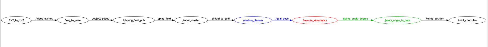

# Tic Tac Toe Robot for MA4825 Project AY23/24 S1
> Team members:  
> - Loh Xin Zhi
> - Loke Kum Yew
> - Thio Zheng Yang  
> - Loong Chor Teng
> - Goh Wei Liang, Terence
> - Raymondal Sankalpa

Project Details:
> OS: Ubuntu 22.04.3 LTS  
> ROS2 distro: Humble

## Project Descroption
This project aims to design a robotic arm capable of intelligence to play a game of tic tac toe. ROS2 is used as the main communication architecture.

## Installing Package
1. Create a new workspace with a `src` subfolder and change directory to `src`. In the terminal,  
```
mkdir -p ttt_robot_ws/src
cd ttt_robot_ws/src
```
2. Download and copy the files to the `src` subfolder. E.g.

> ttt_robot_ws
>> src  
>>> ttt_interfaces  
>>> ttt_perception  
>>> ttt_control  
>>> ttt_kinematics  
>>> DynamixelSDK  
>>> README.md  

3. Install package dependencies and build the package. Source the packages as well
```
cd ~/ttt_robot_ws
rosdep install --from-paths src -y --ignore-src -r
colcon build --symlink-install
source install/setup.bash
```

## Demo
1. Ensure the ESP32-CAM is connect to the the same network as the computer and robot is connect to the robot via the USB port.  
2. Launch the launch file to run all the relevant nodes for the program. In the terminal:
```
ros2 launch ttt_control main_programme.xml
```
3. A display showing the footage captured by the ESP32-CAM should be appear as well as an empty window. The tic tac toe game begins.  
4. After player is done, click on the empty window and press the spacebar to signal the robot to make its move.

The active nodes and topics when program is running properly should be as follows:



Individual nodes can be ran for debugging:
```
ros2 run <package_name> <node_name>
```

## Packages
This project consists of the following packages and their functions:
- ttt_interface: contains all the customed messages used throughout this project, less in the Dynamixel SDK packages 
- ttt_perception: consists of nodes for the perception modules. Nodes:
    - `/cv2_to_ros2`: request frame from ESP32-CAM webserver and publish image data to topic `/video_frame`
    - `/img_to_pose`: read the image data and determine the game piece positions and color as circles. The pose is published to topic `/object_poses`
    - `/playing_field_pub`: determine the current game state (e.g. which piece occupy which spot) and publsih the state to the topic `/play_field`
- ttt_control: consists of the algorithm for the tic tac toe intelligence and the launch file for the project. Node:
    - `/robot_master`: based on current state of the playing field, generate the next best move for the robot. Each box in the 3x3 grid is mapped to a (x,y,z) coordinates. Publish the (x,y,z) coordinates to the topic `/initial_to_goal`
- ttt_kinematics: consists of all nodes regarding the kinematics of the robot. Nodes:
    - `/motion_planner`: from the initial and goal pose, generate the waypoints for the path of the end effector. Publish each waypoint in sequence to the topic `/goal_pose` sonly after the previous pose is reached. For this application, we just wait for 3 seconds.
    - `/inverse_kinematics`: convert the pose from task space  (x,y,z) to joint space (θ1,θ2,θ3,θ4,θgripper) and publish to topic `/joints_angle_degree`
    - `/joints_angle_to_data`: convert the joint angles in degree to integer values to be written to the motor register for position control. The data is published to topic `/joints_position`
- dynamixel_sdk_custom_interface: consist of the custom interfaces used for the DynamixelSDK packages
- dynamixel_sdk: consist of the libraries to interface with the motor hardware controller
- dynamixel_sdk_examples: consist of the exmaple nodes as the customed nodes used for this project. The custom node is:
    - `/joint_controller`: the hardware interface to read and write data to the registers in the Dynamixel smart actuators. Takes in the joints position data and write to the relevant registers for position control

