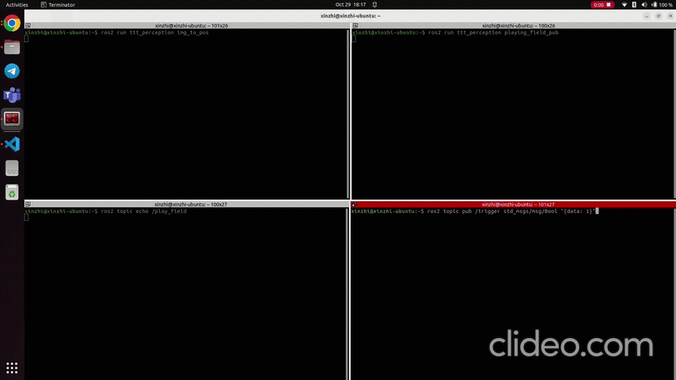

# Robotics Project Perception Module

## ROS2 Packages
There are 2 ROS2 Packages here, `ttt_interfaces` and `ttt_perception`
> `ttt_interfaces` is to define the ROS2 messages used for this module.  
> `ttt_perception` contains the nodes for the modules

### `ttt_interfaces`
The cuistomed messages are:
1.  Circle.msg  
> **string** color  
> **float64** x  
> **float64** y
> **float64** r  

Used to describe a circle at position `x`,`y` with radius `r` and with `color` red, blue or green

2. ObjectPose.msg
> **int8[]** index  
> **ttt_interfaces/Circle[]** circlepose  

`circlepose` hold the list of the `Circle` detected the frame of the video (image)

3. PlayField.msg
> **int8[9]** playfield  
>  
> \# 0 = empty  
> \# 1 = player  
> \# 2 = robot  

`playfield` hold the current status of the 3x3 playing field. It is represented by a 1D arrat with 9 elements.  
e.g.  
[0,0,2,1,0,2,1,1,0] >>  
[[0,0,2],  
[1,0,2],  
[1,1,0]] 

### `ttt_perception`

The nodes are:
1. cv2_to_ros2
> - Publish to topic `/video_frames` of msg type `sensor_msgs/Image`  
> - Using `cv2` library, stream video from a source and convert each frame to a ROS Image so that it can be publish to the topic `/video_frames`

2. img_to_pose  
> - Subscribe to topic `/video_frames` or msg type `sensor_msgs/Image`  
> - Publish to topic `/object_poses` of msg type `ttt_interface/ObjectPose`  
> - Receive a Image message, process it with `cv2` library and publish the *normalised* positions of the different colored circle in each frame of the video to topic `/object_poses`  
> - Note that in `cv2`, origin is from the top left handcorner of the frame, with positive x to the right and positive y downwards

3. playing_field_pub
> - Subscribe to topic `/object_poses` or msg type `ttt_interface/ObjectPose`  
> - Publish to topic `/play_field` of msg type `ttt_interface/PlayField`  
> - Read the current position of the circle from topic `/object_poses` and determine which plot in the tic tac toe grid is empty (0), player's piece (1) or robot's piece (2).
> - Result is published to topic `/play_field`, which is a 1D array as ROS2 messages do not support 2D array

## Example

1. Create a workspace folder with a `src` subfolder and change directory to `src`. You can run the following command in terminal

```
mkdir -p project_ws/src
cd project_ws/src 
```
 2. Download and copy the files and folders here into `src`. 

e.g.  
> project_ws
>> src  
>>> ttt_interfaces  
>>> ttt_perception  
>>> README.md  

3. Install package dependencies and build the package. Source the packages as well
```
cd ~/project_ws
rosdep install --from-paths src -y --ignore-src -r
colcon build
source install/setup.bash
```

4. Run the `img_to_pose` and `playing_field_pub` nodes on 2 separate terminals  

Terminal 1:
```
ros2 run ttt_perception img_to_pose
```
Terminal 2:
```
ros2 run ttt_perception playing_field_pub
```

5. In another terminal, echo the topic `/play_field` to display contents received  
Terminal 3: 
```
ros2 topic echo /play_field
```
6. On another terminal, manaully published to the topic `/trigger` to trigger the program, with the command:  
Terminal 4:
```
ros2 topic pub 
```


> **Note**  
>  Observe the bottem left terminal running the `ros2 topic echo /play_field` command. The array changes value when the red circle changes position
